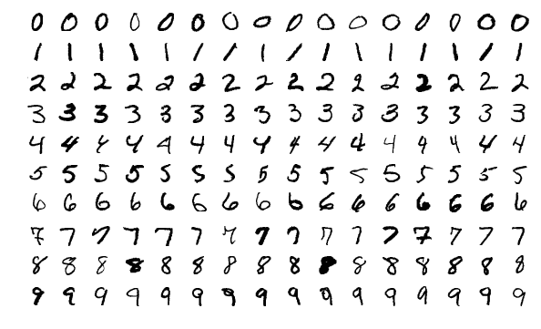

# MLP-Digits-Recognition
An implementation of a Multilayer Perceptron (MLP) neural network from scratch in Rust.

## About
This project was created following [3Blue1Brown's Neural Networks series](https://youtu.be/aircAruvnKk). The goal of is to implement a Multilayer Perceptron (MLP) neural network from scratch in Rust, and use it to recognize handwritten digits from the [MNIST dataset](http://yann.lecun.com/exdb/mnist/).

This project is personal does not, unless otherwise stated, follow any other tutorial or guide; all the code is original.

## Dataset

The dataset used for both training and testing is the [MNIST dataset](http://yann.lecun.com/exdb/mnist/), which contains 60,000 training images and 10,000 testing images of handwritten digits. The images are 28x28 pixels, and the digits are centered in the middle of the image. Examples of the images are shown above.

## Results
> This section is a work in progress.

## License
This work is licensed under the [CC-BY-NC-SA 4.0](https://creativecommons.org/licenses/by-nc-sa/4.0/) license.