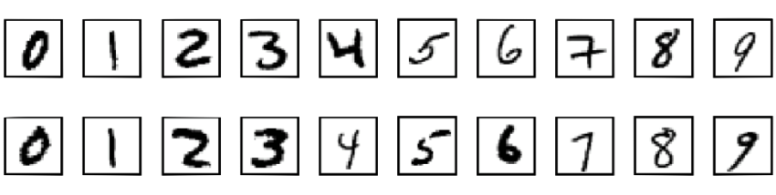

# MLP-Digits-Recognition
An implementation of a Multilayer Perceptron (MLP) neural network from scratch in Rust, to recognize handwritten digits.



## About
### Motivation
This project was created following [3Blue1Brown's Neural Networks series](https://youtu.be/aircAruvnKk). The goal of is to implement a Multilayer Perceptron (MLP) neural network from scratch in Rust, and use it to recognize handwritten digits from the [MNIST dataset](http://yann.lecun.com/exdb/mnist/).

This project is personal does not, unless otherwise stated, follow any other tutorial or guide; all the code is original.

### Technical description
The neural network is a simple Multilayer Perceptron, whose activation function can be chosen between `sigmoid` or `ReLU`. For this specific task, the input layer has `28 * 28 = 784` nodes (neurons) and the output layer has `10` nodes; intermediate layers can be added. The actual prediction is chosen by the index of the node with the highest activation.

The network is trained using [Stochastic Gradient Descent](https://en.wikipedia.org/wiki/Stochastic_gradient_descent). The training set is split into mini-batches of customizable size. The gradient of cost function with respect to each weights and biases, of each layer, is computed using backpropagation. This process can be repeated multiple times by choosing multiple epochs.

## Running instructions
### Compiling and running
This project uses `Cargo`. With `rust` installed on your machine, you can execute the code by running, while at the root of the project:
```console
$ cargo run
```

By default, the program is configured to train a small network, to test it, and to save it. You can change the parameters (described below) in the `main.rs` file, and switch the `LOAD_NETWORK` boolean to `true` to load a network from a `JSON` file instead of training it each time.

Unit tests are also configured for multiple parts of the project. You can make sure that everything is working by running:
```console
$ cargo test
```

### Parameters
You can play with the parameters of the network to try to achieve better results:
- `TRAIN_LENGTH`: the number of images used for training.
- `VALIDATION_LENGTH`: the number of images used for validation.
   > After each epoch, if `VALIDATION_LENGTH != 0`, the program will test the currently trained network on the validation set.
- `TEST_LENGTH`: the number of images used for testing.
- `BATCH_SIZE`: the size of one mini-batch used for [Stochastic Gradient Descent](https://en.wikipedia.org/wiki/Stochastic_gradient_descent). 
  > Note that `TRAIN_LENGTH` should be a multiple of `BATCH_SIZE`, otherwise a warning will be triggered.
- `EPOCHS`: the number of epochs, i.e. the number of times that the network will train on one image.
- `LEARNING_RATE`: also called η (`eta`); the factor by which the gradient is multiplied when adjusting weights and biases.
- Activation function: the non-linear function used for each synapse. 
  > Both [`sigmoid`](https://en.wikipedia.org/wiki/Sigmoid_function) and [`ReLU`](https://en.wikipedia.org/wiki/Rectifier_(neural_networks)) are implemented.

Reference parameters can be seen in the first row of results.

## Dataset
[](http://yann.lecun.com/exdb/mnist/)

The dataset used for both training and testing is the [MNIST dataset](http://yann.lecun.com/exdb/mnist/), which contains 60,000 training images and 10,000 testing images of handwritten digits. The images are 28x28 pixels, and the digits are centered in the middle of the image. Examples of the images are shown above.

## Results
| Layers | Training images | Testing images | Batch size | Epochs | Learning rate | Activation function | Training time |
| - | - | - | - | - | - | - | - |
| 784, 16, 16, 10 | 10 000 | 1 000 | 10 | 30 | 3.0 | Sigmoid | *Not mesured* |

## License
This work is licensed under the [CC-BY-NC-SA 4.0](https://creativecommons.org/licenses/by-nc-sa/4.0/) license.